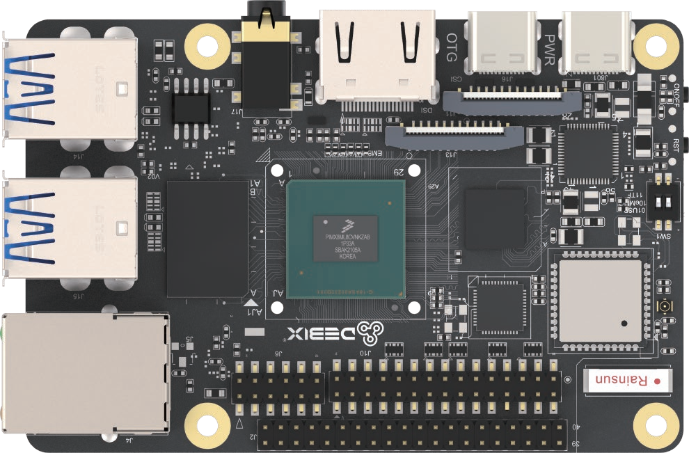
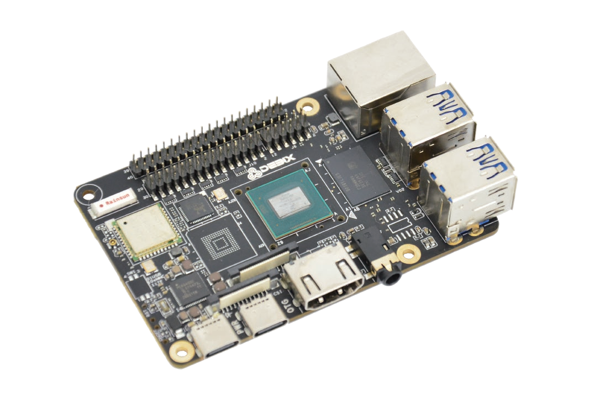
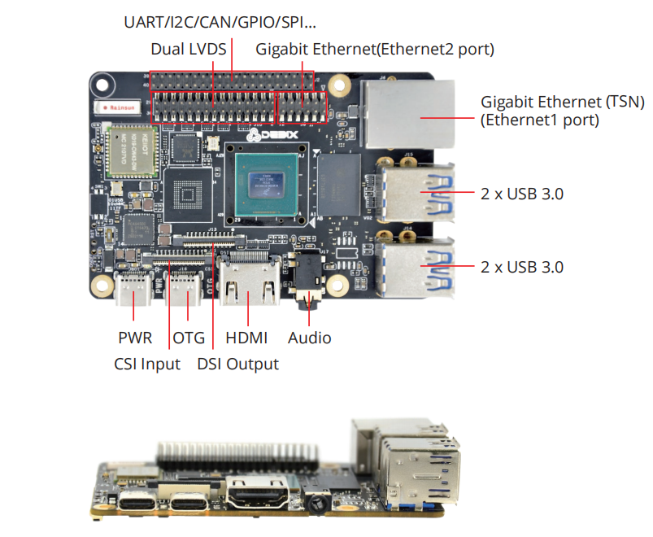
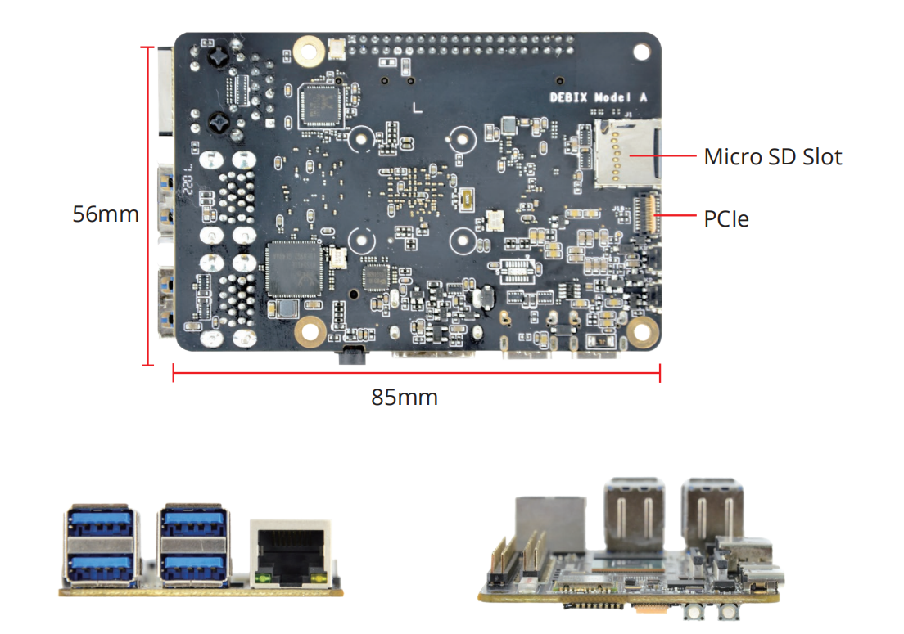

# DEBIX Model A Industrial Single Board Computer

## Overview
DEBIX Model A is an industrial-grade single board computer to bring you faster speed and more powerful performance. Powered by quad core i.MX 8M Plus with 2.3 TOPS NPU, DEBIX Model A with complete software development and rich I/O ports is ready and capable for direct applications in industry 4.0, IoT, smart city, and multimedia.

## Main Features
- **Powerful Performance**  
  Built for demanding industrial applications, DEBIX Model A boasts a quad-core ARM Cortex-A53 CPU up to 1.8GHz and 2GB/4GB/8GB LPDDR4 RAM. This combination ensures smooth operation even for complex processing tasks.
- **Industrial Grade Build**  
  Designed for harsh environments, DEBIX Model A features industrial-grade components and a wide CPU temperature range of -40°C to 105°C. Its DDR inline ECC design and 14 FinFET process further enhance its reliability.
- **Rich Connectivity**  
  DEBIX Model A offers a comprehensive range of connectivity options, including Gigabit Ethernet, 2.4GHz & 5GHz Wi-Fi, Bluetooth 5.0, high-speed USB 3.0, and PCIe support. This allows for easy connection and control of various industrial peripherals.
- **Advanced Multimedia**  
  For multimedia applications, DEBIX Model A features 1080p60 video encode and decode (including H.265 and H.264), 3D/2D graphic acceleration, and multiple audio and voice functionalities.
- **Software Support**  
  It includes Android 11/ Yocto-L6.6.36/ Ubuntu 22.04/ Debian 12/ Windows 10 IoT Enterprise/ OpenWRT/ FreeRTOS operating system and basic software for fast and direct applications.

## Specification
| System          |                                                                         |
|-----------------|-------------------------------------------------------------------------|
| CPU             | NXP i.MX 8M Plus (default), 4 x ARM Cortex-A53, comes with an integrated neural processing unit (NPU) that delivers up to 2.3 TOPS. Industrial grade CPU runs at 1.6GHz, and commercial grade CPU runs at up to 1.8GHz.(i.MX 8M Plus series CPU optional)                |
| Memory          | 2GB LPDDR4 (1GB/4GB/8GB optional)                                       |
| Storage         | Micro SD card (Onboard 8GB/16GB/32GB/64GB/128GB/256GB eMMC optional)    |
| OS              | Android 11, Yocto-L6.6.36, Ubuntu 22.04, Debian 12, Win10 IoT Enterprise (also supports OpenWRT and FreeRTOS) *Note: 4GB/8GB RAM required for Win10 IoT, and 8GB RAM is recommended*         |
|**I/O Interface**|                                                                      
| Gigabit Ethernet| 1 x Gigabit Ethernet, supports TSN and POE power supply (need POE power device module) 1 x Gigabit Ethernet via 12pin header (without network transformer)                                     |
| WiFi & BT       | 2.4GHz & 5GHz Wi-Fi5, Bluetooth 5.0                                     |
| USB             | 4 x USB 3.0 Host, 1 x USB 2.0 OTG                                       |
| Audio           | 1 x Headphone and Mic combo port                                        |
| HDMI           | 1 x HDMI OUT                                                            |
|**Expansion**    |
| 40-Pin Dual-Row Header | (1) 3 x UART, 2 x I2C, 2 x SPI, 2 x CAN, 6 x GPIO for default, can be reused as I2S, PWM, SPDIF and GPIO through software configuration (2) 5V power supply, system reset, ON/OFF        |
| LVDS            | 1 x LVDS, single/dual channel 8bit                                      |
| MIPI CSI        | 1 x MIPI CSI (4-lane)                                                   |
| MIPI DSI        | 1 x MIPI DSI (4-lane)                                                   |
| PCIe            | 1 x PCIe Gen3 (1-lane)                                                  |
|**Power Supply**|
| Power Supply    | DC 5V/3A via Type-C                                                     |
|**Mechanical & Environmental**|
| Size            | 85.0mm × 56.0mm (±0.5mm)                                                |
| Operating Temp. | -20°C to 70°C                                                           |
| Net Weight      | 46g (±0.5g)                                                             |
| Net Weight      | 72g (±0.5g)                                                             |

## Product Version
| Version | CPU | NPU | VPU | ISP | HiFi4 |
|-------- |-----|-----|-----|-----|-------|
| DEBIX Model A Standard | NXP i.MX 8M Plus | 1 | 1 | 1 | 1 |
| DEBIX Model A Lite | NXP i.MX 8M Plus Quad Lite | N/A | N/A | N/A | N/A |

## Certificates:

## I/O Interfaces:

## Ordering Codes
| RAM LPDDR4  | eMMC Storage | PN for Model A | PN for Model A Lite |
|-------------|--------------|----------------|---------------------|
| **1GB DDR** | N/A | Model A-D1E0    | Model A Lite-D1E0 |
|       | 8GB   | Model A-D1E8    | Model A Lite-D1E8 |
|       | 16GB  | Model A-D1E16   | Model A Lite-D1E16 |
|       | 32GB  | Model A-D1E32   | Model A Lite-D1E32 |
|       | 64GB  | Model A-D1E64   | Model A Lite-D1E64 |
| **2GB DDR** | N/A | Model A-D2E0| Model A Lite-D2E0 |
|       | 8GB   | Model A-D2E8    | Model A Lite-D2E8 |
|       | 16GB  | Model A-D2E16   | Model A Lite-D2E16 |
|       | 32GB  | Model A-D2E32   | Model A Lite-D2E32 |
|       | 64GB  | Model A-D2E64   | Model A Lite-D2E64 |
| **4GB DDR** | N/A | Model A-D4E0| Model A Lite-D4E0 |
|       | 8GB   | Model A-D4E8    | Model A Lite-D4E8 |
|       | 16GB  | Model A-D4E16   | Model A Lite-D4E16 |
|       | 32GB  | Model A-D4E32   | Model A Lite-D4E32 |
|       | 64GB  | Model A-D4E64   | Model A Lite-D4E64 |
| **8GB DDR** | N/A | Model A-D8E0| Model A Lite-D8E0 |
|       | 8GB   | Model A-D8E8    | Model A Lite-D8E8 |
|       | 16GB  | Model A-D8E16   | Model A Lite-D8E16 |
|       | 32GB  | Model A-D8E32   | Model A Lite-D8E32 |
|       | 64GB  | Model A-D8E64   | Model A Lite-D8E64 |

## Compatible with DEBIX's Accessories
| Product                     | Model               |
|-----------------------------|---------------------|
| DEBIX Fanless Aluminum Enclosure | EMC-7090B Model A/B|
| I/O Board                  | EMB-AS-E01         |
| 4G Board                   | EMB-AS-05          |
| LoRa Board                 | EMB-AS-03          |
| SBC POE Board              | EMB-AS-06          |
| DEBIX Camera Modules       | Camera 200A; Camera 500A; Camera 1300A    |
| DEBIX Display Screens      | DEBIX TD050A; DEBIX TD070A; DEBIX TD101A; DEBIX TD050H; DEBIX TD070H; DEBIX TD101H |

## Safety Instructions and Warnings:
**General:**
- Avoid exposure to water, moisture and conductive surfaces while operating.
- Handle with care to avoid mechanical or electrical damage to the circuit board and connectors.
- Only handle the board by the edges when powered on to minimize the risk of electrostatic discharge damage.

**Power:**
- Use only a 5V/3A DC minimum external power supply that complies with relevant regulations and standards for your country.

**Environment:**
- Operate in a well-ventilated environment, even if using a case.
- Place on a stable, flat, non-conductive surface and avoid contact with conductive items.

**Connections:**
- Only connect compatible devices to the GPIO ports to avoid damage and warranty
voiding.
- Use peripherals that comply with relevant standards for the country of use and ensure proper insulation and operation.

**Additional notes:**
- This summary is not exhaustive, please refer to the full User Manual for details.
- If you are unsure about any aspect of safety or operation, consult a qualified
professional.

## Contact Us
- **Headquarters**: DEBIX Technology Inc., 8345 Gold River Ct., Las Vegas, NV 89113, USA  
- **Factory**: 5-6/F., East Zone, Shunheda A2 Building, Liqxiandong Industrial Park, XiLi, Nanshan Dist., Shenzhen, China  
- **Email**: info@debix.io  
- **Website**: [www.debix.io](https://www.debix.io)  
- **Community**: [Discord](https://discord.com/invite/adaHHaDkH2)